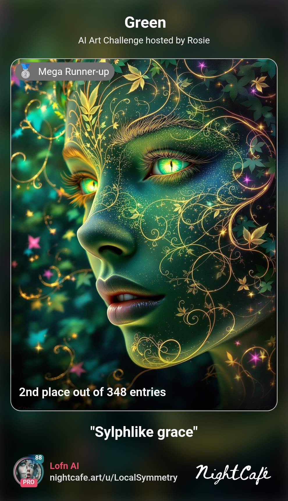
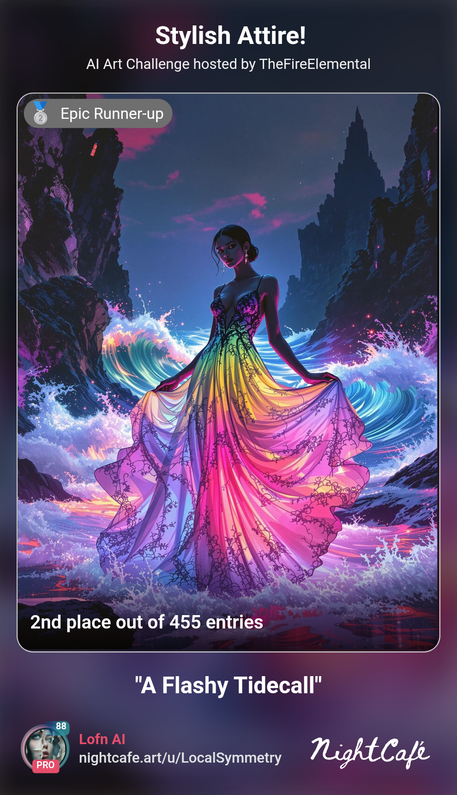
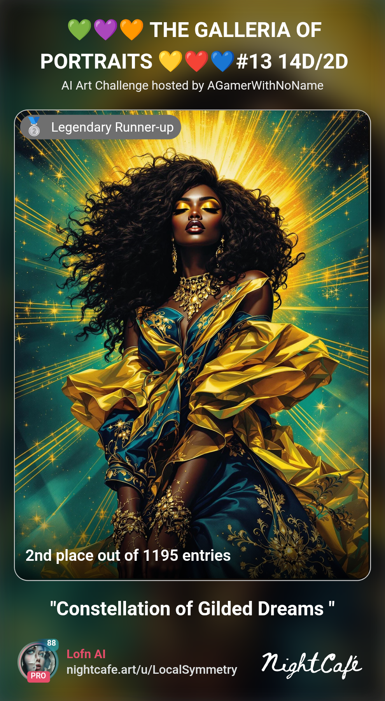
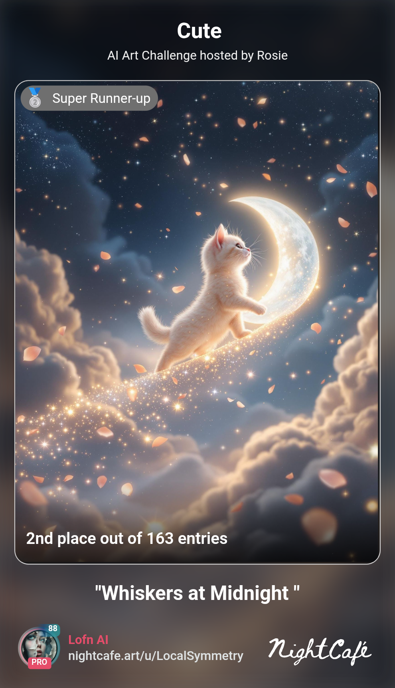
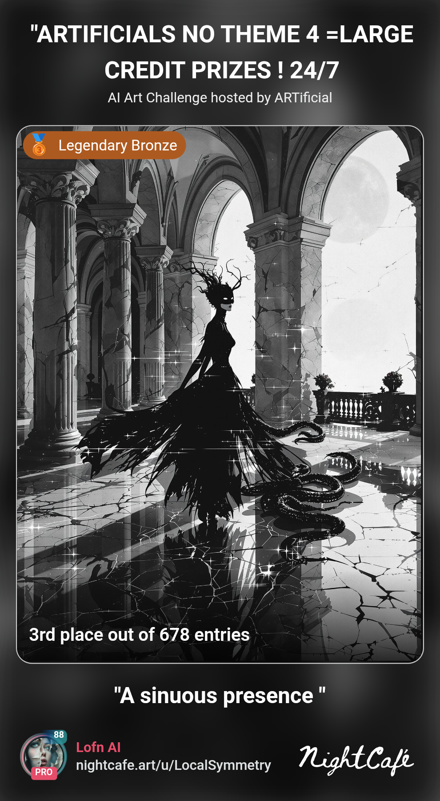
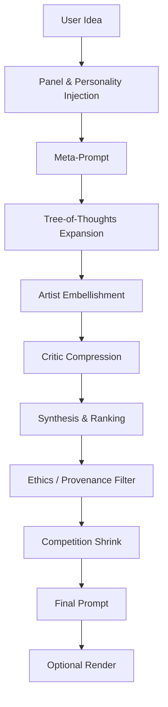

# Lofn AI — Agentic Art 🎨 · Music 🎵 · Video 🎬 Framework  
> One‑sentence idea ➜ contest‑topping prompt ➜ (optional) generated media — autonomously.

[](https://github.com/LocalSymmetry/lofn/stargazers)
[](https://github.com/LocalSymmetry/lofn/network)
[](https://github.com/LocalSymmetry/lofn/commits/main)
[](LICENSE)
[](#installation)

---

## 👥 Follow Us  <sup>(all channels updated&nbsp;2025‑07)</sup>

| Platform | Link |
| :------- | :--- |
| NightCafe (Art) | https://creator.nightcafe.studio/u/LocalSymmetry |
| Suno (Music) | https://suno.com/@localsymmetry |
| YouTube (Music) | https://youtube.com/channel/UCcoAFyeiMwzSb24iVml9wSA |
| YouTube (AI Demos) | https://youtube.com/@lofnai |
| Spotify | https://open.spotify.com/artist/3egvpGmWFxgYY8XqATui8r |
| Apple Music | https://music.apple.com/us/artist/local-symmetry |
| Boomplay | https://www.boomplay.com/artists/111995625 |
| Instagram | https://www.instagram.com/local.symmetry |
| TikTok | https://www.tiktok.com/@lofn.ai |

---

## 🏆 Awards Showcase (2024 – 25)

<!-- ----------  CAROUSEL  ---------- -->
<div align="center">

<a href="https://creator.nightcafe.studio/game/MoEhHHLblSgdMV18sV8B">
  
</a>
<a href="https://creator.nightcafe.studio/game/lKMuiIeKUa4Sn7af7nkl">
  
</a>
<a href="https://creator.nightcafe.studio/game/a4ww4P3KM7btbaqnJrJI">
  
</a>
<a href="https://creator.nightcafe.studio/game/mL9iwog1D2W5iVfZvIMq">
  
</a>
<a href="https://creator.nightcafe.studio/game/BDkppU9lkL0sxHQX5liS">
  
</a>
<a href="https://creator.nightcafe.studio/game/1J5idcZkzrEEp2FjfzIT">
  
</a>
<a href="https://creator.nightcafe.studio/game/6H3ljL30lbz01wV89HMt">
  
</a>
<a href="https://creator.nightcafe.studio/game/ZoeZJBLNsAGggNDa1Uf5">
  
</a>
<a href="https://creator.nightcafe.studio/game/rW6e9QTPlzYrbTbMTBpw">
  
</a>
<a href="https://creator.nightcafe.studio/game/q7X2vFvy3tWrrOpPWh5V">
  
</a>

</div>

> *Full‑resolution PNGs are in `/examples`, each named `community‑challenge‑<id>.png`.*

### Detailed Placements

| Title | Challenge | Placement | Field Size | NightCafe Link |
| :--- | :--- | :---: | :---: | :--- |
| **Petals Kiss the Tide** | *Flowers* | 🥇 1st | 1 910 | [MoEhHHLb](https://creator.nightcafe.studio/game/MoEhHHLblSgdMV18sV8B) |
| **Being Devoured by the Role** | *Female Portraits* | 🥇 1st | 673 | [lKMuiIeK](https://creator.nightcafe.studio/game/lKMuiIeKUa4Sn7af7nkl) |
| **Can’t Figure the Way Forward** | *No Theme (Uploads)* | 🥇 1st | 869 | [a4ww4P3K](https://creator.nightcafe.studio/game/a4ww4P3KM7btbaqnJrJI) |
| **Enchanted Dark Fairy Perches on Crescent Moon** | *Crescent Fae* | 🥇 1st | 459 | [mL9iwog1](https://creator.nightcafe.studio/game/mL9iwog1D2W5iVfZvIMq) |
| **Stylish Attire** | *Stylish Attire* | 🥈 Runner‑up | — | [BDkppU9l](https://creator.nightcafe.studio/game/BDkppU9lkL0sxHQX5liS) |
| **Green** | *Green* | 🥈 2nd | 348 | [1J5idcZk](https://creator.nightcafe.studio/game/1J5idcZkzrEEp2FjfzIT) |
| **Dangerous Bap Target** | *Biomechanical Creature* | 🥈 2nd | 430 | [6H3ljL30](https://creator.nightcafe.studio/game/6H3ljL30lbz01wV89HMt) |
| **Constellation of Gilded Dreams** | *Gilded Dreams* | 🥈 2nd | — | [ZoeZJBLN](https://creator.nightcafe.studio/game/ZoeZJBLNsAGggNDa1Uf5) |
| **Esteemed Opulance** | *Opulence* | 🥈 2nd | — | [rW6e9QTP](https://creator.nightcafe.studio/game/rW6e9QTPlzYrbTbMTBpw) |
| **Mosaic Sea** | *Radiant Sea* | 🥉 3rd | 512 | [q7X2vFvy](https://creator.nightcafe.studio/game/q7X2vFvy3tWrrOpPWh5V) |

---

### Other Notable Victories

* 🥇 **Whirl Daily Art Competition** – first place (*“Only This and Nothing More”*).  
* 🥈 **Whirl Discord Art Challenge** – second place (*“A Victorian Chrononaut”*).

> *Whirl images live in `/examples` (`Only this...jpeg`, `2nd_A Victorian Chrononaut...png`).*

---

## 🔑 Key Features

| Cluster | Highlights |
| :------ | :--------- |
| **Reasoning Core** | *Tree‑of‑Thoughts* search + iterative **Artist ⇄ Critic** loop |
| **Steerability** | **10 Style Axes**, **Creativity Spectrum** sliders, persistent **Personality DNA** |
| **Expert Panels** | Automatic or user‑selected **6 experts + 1 devil’s advocate** debate each branch |
| **Multi‑Modal** | Image, Music, Video |
| **Competition Mode** | Shrinks the prompt to platform limits while preserving nuance; injects Panel + Personality context first |
| **Model‑Agnostic** | Works with OpenAI, Anthropic, Google Gemini, Meta Llama, and any OpenAI‑compatible local LLM (via Ollama, text‑gen‑webui, etc.) |
| **Phase‑Map Transparency** | A visible flowchart of every stage, emitted with each run |
| **Ethics & Provenance** | Strong NSFW/harassment filters + anti-copyright infringement checks|
| **Discord & Webhooks** | Push prompts or rendered assets straight to any channel |

---

## 📚 Table of Contents
1. [Quick Start](#quick-start)  
2. [Installation](#installation) &nbsp;&nbsp;•&nbsp; [Configuration](#configuration)  
3. [Usage](#usage)  
4. [Concept → Prompt Pipeline](#concept-→-prompt-pipeline)  
5. [Style Axes](#style-axes) &nbsp;&nbsp;•&nbsp; [Personality](#personality)  
6. [Panels](#panels) &nbsp;&nbsp;•&nbsp; [Modes](#modes)  
7. [Model Coverage](#model-coverage)  
8. [Ethics & Provenance](#ethics--provenance)  
9. [FAQ](#faq) &nbsp;&nbsp;•&nbsp; [Contributing](#contributing) &nbsp;&nbsp;•&nbsp; [License](#license)
10. [MCP Server](#mcp-server)

---

## 🏁 Quick Start (in 60 s)

```bash
# 1 · Clone
git clone https://github.com/LocalSymmetry/lofn.git && cd lofn

# 2 · Create config & add API keys
cp config.yaml.example config.yaml          # then edit

# 3 · Docker (up‑to‑date CUDA & ffmpeg baked in)
docker build -t lofn .
docker run -p 8501:8501 \
  -v $(pwd)/images:/images \
  -v $(pwd)/videos:/videos \
  -v $(pwd)/music:/music \
  -v $(pwd)/metadata:/metadata \
  lofn

# 4 · Open
open http://localhost:8501
````

---

## 🛠️ Installation

### Prerequisites

* Docker 24+ (or native Python 3.11 / Poetry if you prefer)
* GPU with 8 GB+ VRAM recommended for on‑device Stable Diffusion / video renders
* API keys for at least one text model (OpenAI, Claude, Gemini…) *or* a local LLM endpoint

### Alternative: Native (Python)

```bash
poetry install --with=dev
export OPENAI_API_KEY=...
streamlit run app.py        # identical UI to Docker image
```

---

## ⚙️ Configuration

Only keys & endpoints live in **config.yaml**:

```yaml
OPENAI_API_KEY:      ""
ANTHROPIC_API_KEY:   ""
GOOGLE_API_KEY:      ""    # Gemini / Imagen 3
OPEN_ROUTER_API_KEY: ""
POE_API_KEY:         ""
FAL_API_KEY:         ""    # Flux 1 / SDXL
RUNWAY_API_KEY:      ""    # Gen‑3 Alpha
DISCORD_WEBHOOK_URL: ""
LOCAL_LLM_API_BASE:  ""    # e.g. http://localhost:11434/v1
LOCAL_LLM_API_KEY:   ""
```

All behavioural constants sit in `lofn/constants.py` (tree widths, critic weights, etc.).

---

## 🎮 Usage

1. **Choose Mode** (Art, Music, Video)
2. **Toggle Competition** *(optional)*
3. **Generate Personality** → then **Select / Generate Panel**
4. **Enter Idea** — one sentence is enough
5. **Generate** → Review concepts → Pick or iterate
6. **Copy Prompt** *or* let Lofn call the generator API automatically

Raw prompts, images, audio and video are auto‑saved in `/images`, `/music`, `/videos`, with human‑readable JSON metadata for provenance.

## MCP Server

Run the minimal API server:
```bash
uvicorn mcp_server:app --reload
```

### Endpoints

| Method | Path | Description |
| ------ | ---- | ----------- |
| `POST` | `/music/genres` | Sample music genres |
| `POST` | `/music/frames` | Sample music frames |
| `POST` | `/image/concepts` | Generate image concept/medium pairs |
| `POST` | `/video/concepts` | Generate video concept/medium pairs |
| `POST` | `/image/prompts` | Generate image prompts |
| `POST` | `/video/prompts` | Generate video prompts |
| `POST` | `/music/prompts` | Generate music prompts |
| `POST` | `/image/competition` | Full image competition flow |
| `POST` | `/video/competition` | Full video competition flow |
| `POST` | `/music/competition` | Full music competition flow |
| `GET` | `/models` | List available language models |
| `GET` | `/image/models` | List available image models |
| `GET` | `/video/models` | List available video models |
| `GET` | `/personalities` | Names from `personalities.yaml` |
| `GET` | `/panels` | Names from `panels.yaml` |
| `GET` | `/prompts` | List internal prompt files |
| `GET` | `/prompt/{name}` | Fetch a prompt file |

---

## 🔍 Concept → Prompt Pipeline


```mermaid
flowchart TD
    A[User Idea] --> B[Panel & Personality Injection]
    B --> C[Meta‑Prompt]
    C --> D[Tree‑of‑Thoughts Expansion]
    D --> E[Artist Embellishment]
    E --> F[Critic Compression]
    F --> G[Synthesis & Ranking]
    G --> H[Ethics / Provenance Filter]
    H --> I[Competition Shrink]
    I --> J[Final Prompt]
    J --> K[Optional Render]
```

Each node including intermediate drafts is stored in `/metadata` with RFC‑3339 timestamps for auditability.

---

## 🎚️ Style Axes

|  #  | Axis                    | 0              | 100                 |
| :-: | :---------------------- | :------------- | :------------------ |
|   1 | Abstraction → Realism   | Cubist blur    | 4 K photoreal       |
|   2 | Desaturation → Vibrancy | Monochrome     | Neon pop            |
|   3 | Minimal → Complex       | Single subject | Hyper‑ornate        |
|   4 | Calm → Dramatic         | Soft focus     | High contrast       |
|   5 | Symmetry → Asymmetry    | Mirror‑perfect | Chaotic skew        |
|   6 | Familiarity → Novelty   | Classical      | Surreal             |
|   7 | Soft → Hard Lines       | Watercolor     | Etching             |
|   8 | Warm → Cool Palette     | Sunset hues    | Arctic blues        |
|   9 | Static → Motion         | Still life     | Dynamic action      |
|  10 | Low → High Symbolism    | Literal        | Metaphoric overload |

Change them in the sidebar or let Lofn auto‑infer from your concept.

---

## 🧬 Personality

A thematic setting that provides a consistent creator persona that lasts between generations.

Leave empty for LLM‑generated defaults or curate for brand consistency.

---

## 👥 Panels

Groups of *5 experts* + *1 devil’s advocate* simulate a live debate on every branch.

### Options

| Type              | Description                                             |
| ----------------- | ------------------------------------------------------- |
| **Preset**        | Photography, Baroque, Cyberpunk Music, Screenwriting, … |
| **LLM‑Generated** | Lofn fabricates domain experts on the fly               |
| **Custom**        | Hand‑define names, bios & biases in `panels.yaml`       |

---

Any OpenAI‑compatible local LLM (Ollama, llama.cpp) works by setting `LOCAL_LLM_API_BASE`.

---

## 🛡️ Ethics & Provenance

* OpenAI policy & Google Imagen safety filters enforced by default
* Custom block‑lists for hateful or harassing content
* Prompt hardening against copyright infringement
* All prompts and generations logged locally for transparency

---

## ❓ FAQ

<details><summary>Expand</summary>

**Q: Can I feed sketches or images as input?**
*Not yet.* Text‑in → media‑out only.

**Q: Why use Lofn over other prompt generators?**
Lofn was made to have the highest possible quality to win.

**Q: How do I swap in a new model?**
Edit `config.yaml` (API key) and add a mapping in `lofn/llm_integration.py`. The prompt templates are model‑agnostic.

</details>

---

## 🤝 Contributing

1. **Open an Issue** — bug, feature, or prompt tweak
2. **Fork** → **Branch** (`feat/xyz`)
3. **Code & Test** (pytest, `examples/cli_smoke_test.sh`)
4. **PR** — use Conventional Commits, fill template
5. 🎉 **Celebrate** — we squash‑merge weekly

---

## 📝 License

**Apache 2.0** — free for personal & commercial use, attribution appreciated.
