# Lofn AI Art Generator

Lofn is an open-source advanced AI art generator that utilizes cutting-edge natural language processing and image generation techniques to create unique and compelling artwork. It determines the subject, the art style, the presentation, generates the images, titles the images, creates an instagram post with hashtags, and generates SEO keywords! By leveraging a sophisticated Tree of Thoughts prompting approach and an innovative critic/artist refinement methodology, Lofn produces art that is both emotionally resonant and visually captivating.


## Table of Contents

- [Key Features](#key-features)
- [Installation](#installation)
  - [Docker](#docker)
- [Getting Started](#getting-started)
- [Usage](#usage)
- [What Makes Lofn Unique](#what-makes-lofn-unique)
  - [Tree of Thoughts Prompting](#tree-of-thoughts-prompting)
  - [Critic/Artist Refinement Methodology](#criticartist-refinement-methodology)
  - [Style Personalization with Style Axes and Creativity Spectrum](#style-personalization-with-style-axes-and-creativity-spectrum)
  - [Extensive Language Model Support](#extensive-language-model-support)
  - [Advanced Image and Video Generation Capabilities](#advanced-image-and-video-generation-capabilities)
  - [Discord Integration](#discord-integration)
- [Awards and Recognition](#awards-and-recognition)
- [Examples](#examples)
- [Comparison of Language Model Outputs](#comparison-of-language-model-outputs)
- [Lofn's Prompt Structure and Process Steps](#lofns-prompt-structure-and-process-steps)
- [Contributing](#contributing)
- [License](#license)

## Key Features

- **Tree of Thoughts Prompting**: Enables strategic exploration and generation of ideas.
- **Critic/Artist Refinement Methodology**: Allows iterative improvement of generated artwork.
- **Style Personalization**: Customize your art with style axes and creativity spectrum adjustments.
- **Extensive Language Model Support**: Choose from a wide range of language models, including GPT-4, Claude, Gemini, and more.
- **Advanced Image and Video Generation**: Supports multiple image models and integrates with Runway Gen-3 Alpha for video generation.
- **Discord Integration**: Send generated prompts directly to a Discord channel for seamless use with platforms like Midjourney.
- **Ethical AI Art Generation**: Incorporates guidelines to ensure ethically generated content respecting cultural sensitivities.

## Installation

To set up Lofn, follow these steps:

1. **Clone the Lofn repository**:

   ```bash
   git clone https://github.com/LocalSymmetry/lofn.git
   ```

2. **Navigate to the project directory**:

   ```bash
   cd lofn
   ```

3. **Set up your API keys**:

   - Copy the provided `config.yaml` template:

     ```bash
     cp lofn/config.yaml.example lofn/config.yaml
     ```

   - Fill in your API keys for the necessary services (e.g., OpenAI, Anthropic, Google, Poe, Discord) in the `config.yaml` file.

4. **Build the Docker image**:

   ```bash
   docker build -t lofn .
   ```

5. **Run the Docker container**:

   ```bash
   docker run -p 8501:8501 -v $(pwd)/images:/images -v $(pwd)/metadata:/metadata lofn
   ```

6. **Access the Lofn UI**:

   Open your web browser and navigate to `http://localhost:8501`.

**Note**: Ensure that you have Docker installed and running on your system.

### Docker

Alternatively, you can use the provided `Dockerfile` and `entrypoint.sh` scripts to containerize Lofn for consistent deployment across environments.

## Getting Started

1. **Launch Lofn**:

   - After installation, start Lofn using the provided Docker commands or your desired setup.

2. **Access the UI**:

   - Navigate to `http://localhost:8501` in your web browser.

3. **Begin Creating Art**:

   - Follow the usage instructions below to start generating art with Lofn.

## Usage

1. **Open the Lofn UI in your web browser**.

   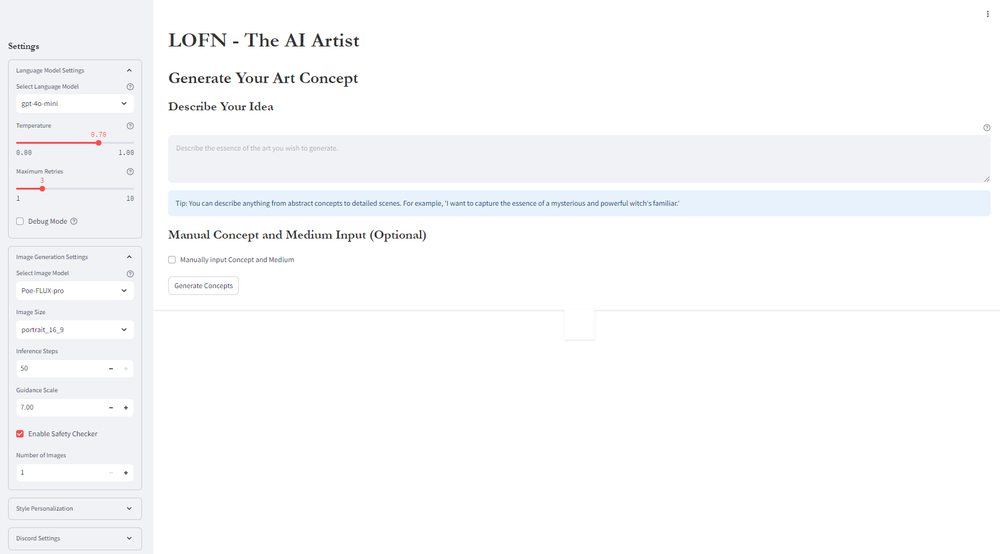

   Enter your idea or concept in the text area provided. For example, "I want to capture the essence of a mysterious and powerful witch's familiar."

2. **Adjust the settings in the sidebar**.

   - **Language Model**: Select from a wide range of language models, including GPT-4, Claude, Gemini, and more.
   - **Image Generation Settings**: Choose the image model and adjust parameters such as image size, number of images, and more.
   - **Style Personalization**: Customize the style axes and creativity spectrum to influence the artistic output.
   - **Discord Integration**: Enable and configure if you wish to send prompts to a Discord channel.

3. **Generate Concepts**.

   Click the **"Generate Concepts"** button to initiate the concept generation process. Lofn will generate a set of concepts and mediums based on your input.

   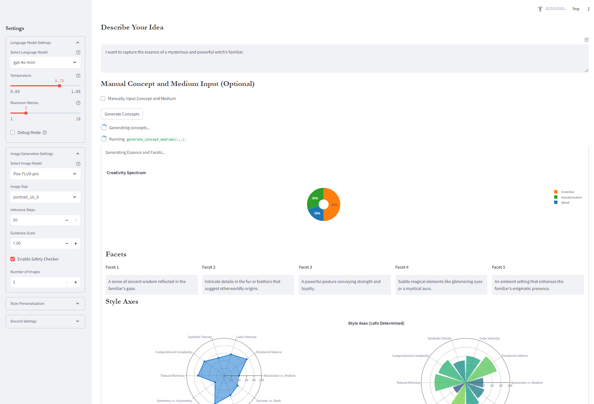

4. **Select Concepts and Generate Prompts**.

   Review the generated concepts and mediums. Select the ones you wish to explore further. Then, click **"Generate Image Prompts for Selected Concepts"** to create detailed prompts suitable for AI image generation.

   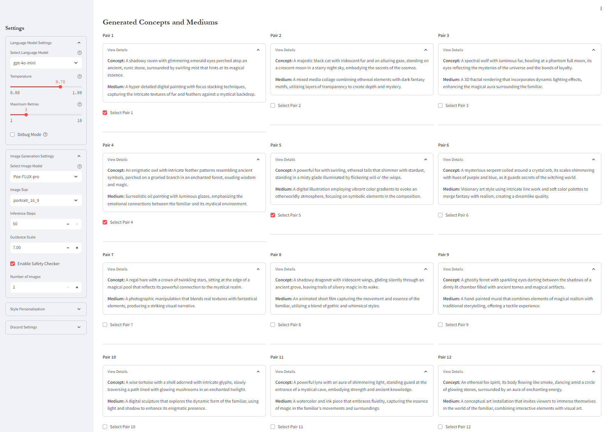

5. **View and Use the Generated Prompts**.

   The UI will display the generated prompts for the selected concept and medium pairs. You can use these prompts with image generation platforms like Midjourney, DALL·E, or any other compatible service.

   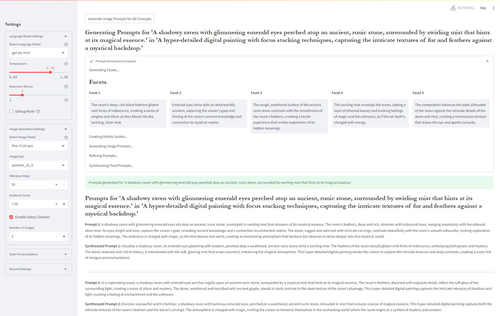

6. **Generate Images**.

   Lofn can generate images directly if you have configured the image generation settings accordingly. The images will be displayed in the UI and saved to your specified output directory.

   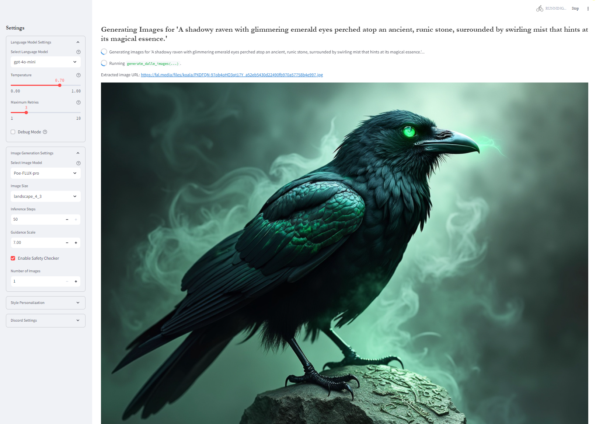

7. **Review Generated Content**.

   - View the generated images, titles, Instagram captions, and SEO keywords.
   - Optionally, generate video prompts compatible with Runway Gen-3 Alpha.

   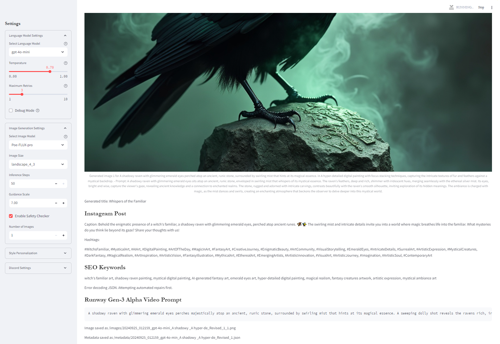

## What Makes Lofn Unique

### Tree of Thoughts Prompting

Lofn utilizes a Tree of Thoughts (ToT) prompting approach, enabling the AI to explore and generate ideas in a strategic and coherent manner. By maintaining a tree structure of intermediate thoughts, Lofn self-evaluates its progress and makes informed decisions during the art generation process.

### Critic/Artist Refinement Methodology

Lofn incorporates a critic/artist refinement methodology for iterative improvement of generated artwork. The AI assumes both critic and artist roles, critiquing the generated content based on predefined criteria and refining it accordingly. This results in more sophisticated and polished artwork compared to single-pass generation methods.

### Style Personalization with Style Axes and Creativity Spectrum

Customize your art with Lofn's style personalization features. The **Style Axes** and **Creativity Spectrum** allow you to fine-tune the artistic output to match your vision.

#### Style Axes

The Style Axes control various aspects of the artwork's style, each ranging from 0 to 100:

1. **Abstraction vs. Realism**: Controls the level of abstraction in the artwork.
2. **Emotional Valence**: Adjusts the emotional tone from negative to positive.
3. **Color Intensity**: Determines the vibrancy of colors.
4. **Symbolic Density**: Varies the use of symbolism versus literal representation.
5. **Compositional Complexity**: Sets the intricacy of the composition.
6. **Textural Richness**: Influences the richness of textures.
7. **Symmetry vs. Asymmetry**: Balances symmetrical and asymmetrical elements.
8. **Novelty**: Adjusts the level of originality and innovation.
9. **Figure-Ground Relationship**: Controls the distinction between main subjects and background.
10. **Dynamic vs. Static**: Determines the sense of movement in the artwork.

By adjusting these axes, you can guide the AI to produce art that aligns with specific stylistic preferences.

#### Creativity Spectrum

The Creativity Spectrum allows you to set the balance between different levels of creative interpretation:

- **Literal (%):** Realistic, direct interpretations closely tied to the input.
- **Inventive (%):** Creative interpretations that add unique elements while remaining plausible.
- **Transformative (%):** Highly original, abstract, or avant-garde interpretations that transform the input in unexpected ways.

The percentages should total 100%, distributing the focus among these creative levels. This spectrum guides the AI in generating concepts and prompts that match your desired level of creativity.

### Extensive Language Model Support

Lofn supports a wide range of language models, allowing you to select the one that best suits your needs. Supported models include:

- **OpenAI models**: GPT-4, GPT-3.5-turbo, GPT-4o, and more.
- **Anthropic's Claude models**: Claude 3.5 Sonnet, Claude 3.5 Opus, among others.
- **Google's Gemini models**: Gemini 1.5 Pro, Gemini 1.5 Flash.
- **Poe models**: Diverse models accessible via the Poe API.
- **o1-mini** and other specialized models.

This flexibility lets you leverage the strengths of different models for varied outputs. Each model may offer unique styles and nuances in the generated content.

### Advanced Image and Video Generation Capabilities

Lofn provides extensive image generation options:

- **Image Models Supported**:

  - **DALL·E 3**
  - **Ideogram**
  - **FAL models** (`fal-ai/flux-pro`, `fal-ai/fast-sdxl`, etc.)
  - **Poe-integrated image models**

- **Runway Gen-3 Alpha Integration**:

  Generate detailed prompts compatible with Runway's Gen-3 Alpha video generation model, enabling the creation of high-fidelity, cinematic videos based on your concepts.

### Discord Integration

Lofn can send generated prompts directly to a Discord channel using webhooks, making it easy to use with platforms like Midjourney. Configure your webhook URL in the settings, and Lofn will handle the rest.

## Awards and Recognition

Lofn has received notable recognition in the AI art community:

- **First Place** in the Whirl Daily Art Competition.

  

- **Second Place** in Whirl's Discord Art Challenge.

  

- **Top 20** in multiple AI art competitions:

  - 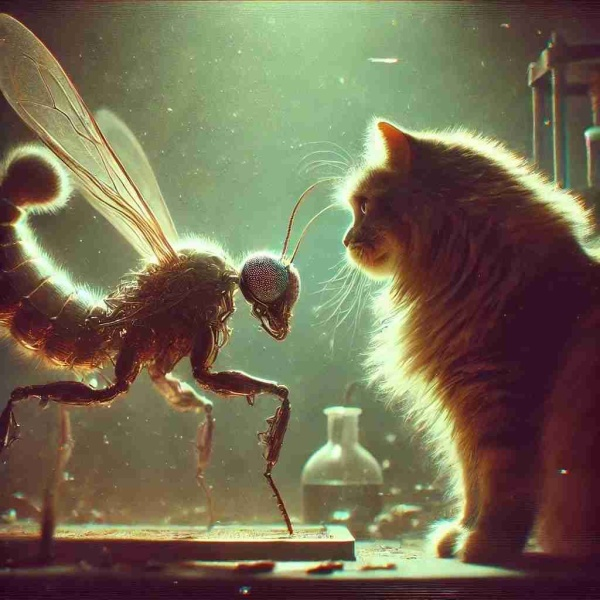

  - 

  - 

  - 

  - 

  - 

  - 

## Examples

Below are examples showcasing Lofn's refinement process, generated from the input "I want to capture the essence of a mysterious and powerful witch's familiar." using o1-preview and Ideogram v2.

### Concept: A shadowy black cat with emerald eyes, its fur subtly blending into tendrils of dark mist, perched atop an ancient, moss-covered grimoire that glows faintly, surrounded by ethereal floating runes that emit a soft, eerie luminescence in a dimly lit, arcane chamber.  

**Medium**: Ethereal shadow painting using luminescent inks on layered translucent silk panels, creating depth and movement as light passes through, highlighting the glowing runes and misty elements in the dimly lit scene. 

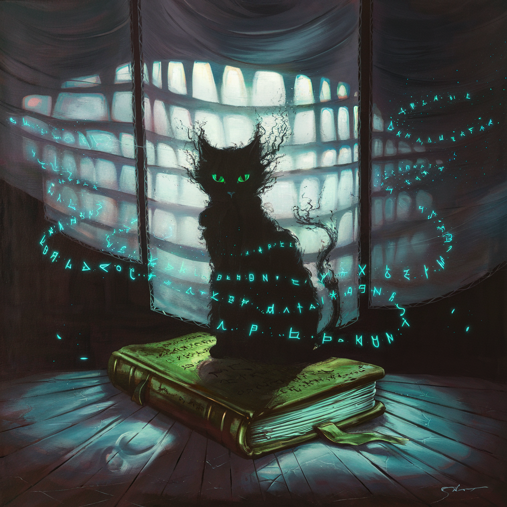

*Final Prompt:* An ethereal shadow painting using luminescent inks on layered translucent silk panels, portraying a shadowy black cat with piercing emerald eyes that subtly dissolve into tendrils of dark mist, emanating an aura of mystery and supernatural presence in a dimly lit arcane chamber. Perched atop an ancient, moss-covered grimoire that emits a faint, otherworldly glow, the cat is surrounded by ethereal floating runes whose soft luminescence casts shifting patterns upon the layered silk, intensifying the mystical atmosphere. The interplay of light passing through the luminescent inks creates depth and movement, bringing the glowing runes and misty elements to life with mesmerizing fluidity.

### Concept: A raven with wings made of swirling galaxies, each feather shimmering with starlight, soaring beneath a looming blood moon over a surreal landscape where the ground ripples like water and ancient, floating monoliths inscribed with runes hover in the distance.

**Medium**: Chromatic fractal tapestry woven with iridescent and metallic threads, enhanced with holographic overlays to depict the swirling galaxies in the raven's wings and the surreal landscape.

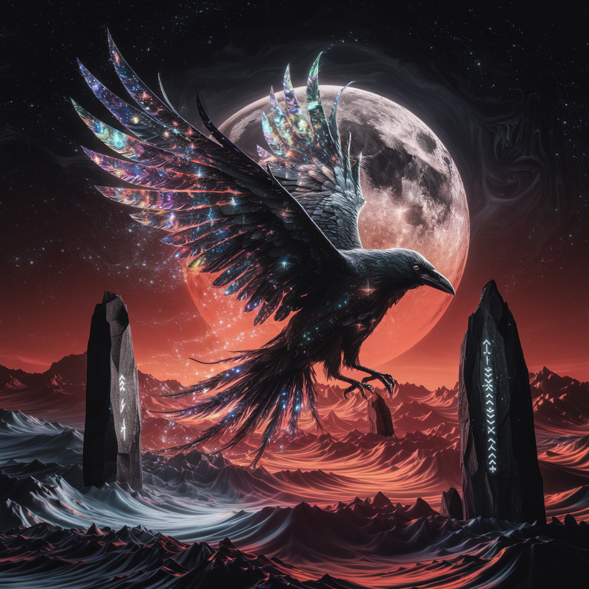

*Final Prompt:* An enigmatic raven with wings made of swirling galaxies, each feather shimmering with starlight woven from iridescent and metallic threads, soars gracefully beneath a looming blood moon in a chromatic fractal tapestry enhanced with holographic overlays, illuminating its path through a surreal landscape of rippling ground and ancient, floating monoliths inscribed with glowing runes.

These examples demonstrate how Lofn's iterative refinement process leads to highly detailed and evocative prompts, resulting in compelling artwork.

### Refinement Process Example - Cat Familiar
For the following concept and medium pair, the final prompts generated and further refined through two steps: The initial generation is first enhanced by an artist and then that result is refined by an art critic. The goal is to have the language model brainstorm additional impactful elements through the artist and then have the result refined to smooth any stylistic clashes that could result. 

**Concept:** A shadowy black cat with emerald eyes, its fur subtly blending into tendrils of dark mist, perched atop an ancient, moss-covered grimoire that glows faintly, surrounded by ethereal floating runes that emit a soft, eerie luminescence in a dimly lit, arcane chamber.  

**Medium**: Ethereal shadow painting using luminescent inks on layered translucent silk panels, creating depth and movement as light passes through, highlighting the glowing runes and misty elements in the dimly lit scene. 

#### Step 1: Initial Prompt Generation

*Initial Prompt:* An ethereal shadow painting using luminescent inks on layered translucent silk panels, depicting a shadowy black cat in a dimly lit arcane chamber, its fur unfolding into tenebrous wisps that transition into swirling tendrils of dark mist. The mist contains subtle fractal patterns, hinting at infinite complexity and the mysteries of the spirit world. Subtle backlighting enhances the mist's translucence, creating an ethereal glow against the backdrop. Deep charcoal greys blend with muted blues and hints of violet, composing a mysterious and spectral palette. Luminescent inks give the mist a tangible movement that shifts as the viewer's perspective changes.

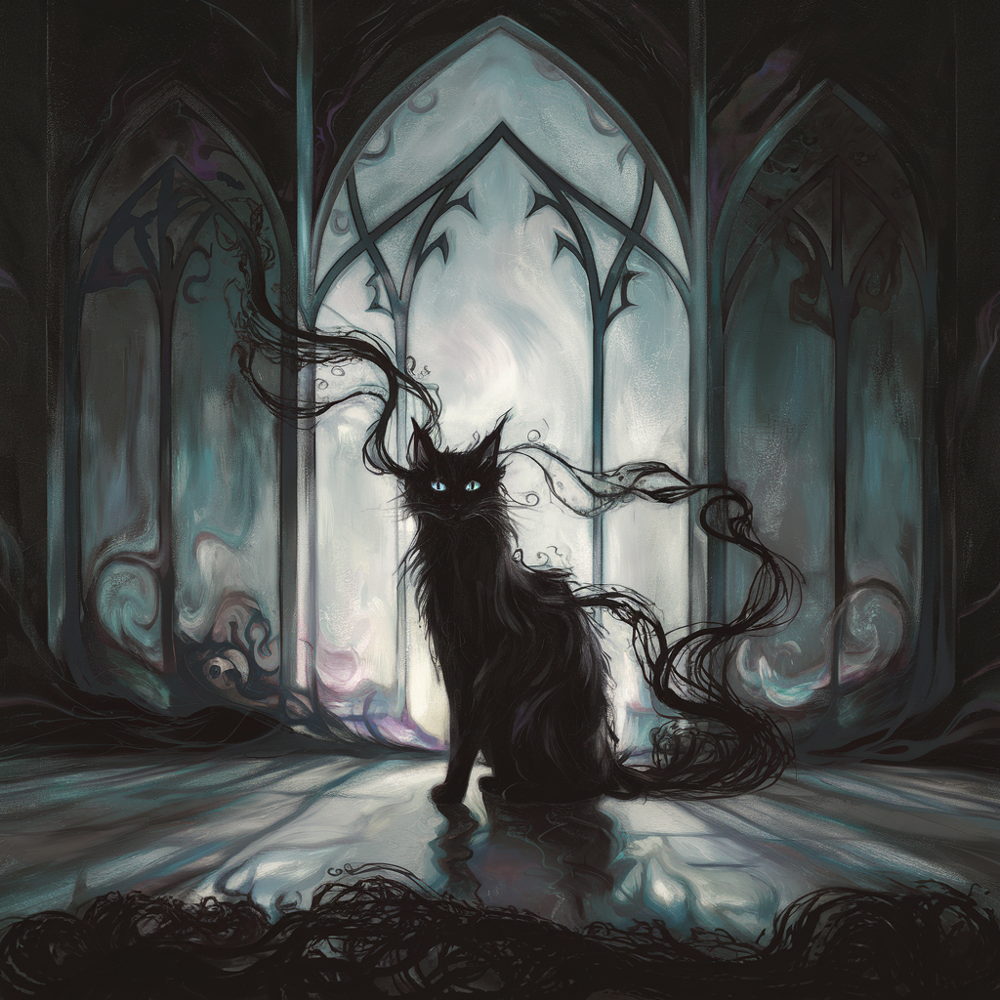

#### Step 2: Artist Refinement and Extension

*Artist Refined Prompt:* An ethereal shadow painting using luminescent inks on layered translucent silk panels, depicting a shadowy black cat whose fur subtly dissolves into tendrils of dark mist, emanating an aura of mystery and supernatural presence. Piercing emerald eyes, adorned with intricate Celtic knot patterns, glow softly, hinting at ancient magic and forbidden knowledge. The cat perches atop an ancient, moss-covered grimoire that emits a faint, otherworldly glow, symbolizing hidden powers. Ethereal floating runes encircle the scene, their soft luminescence casting shifting patterns upon the layered silk, intensifying the mystical atmosphere. The dimly lit arcane chamber is shrouded in shadows, the interplay of light passing through the luminescent inks creating depth and movement, bringing the glowing runes and misty elements to life with mesmerizing fluidity.

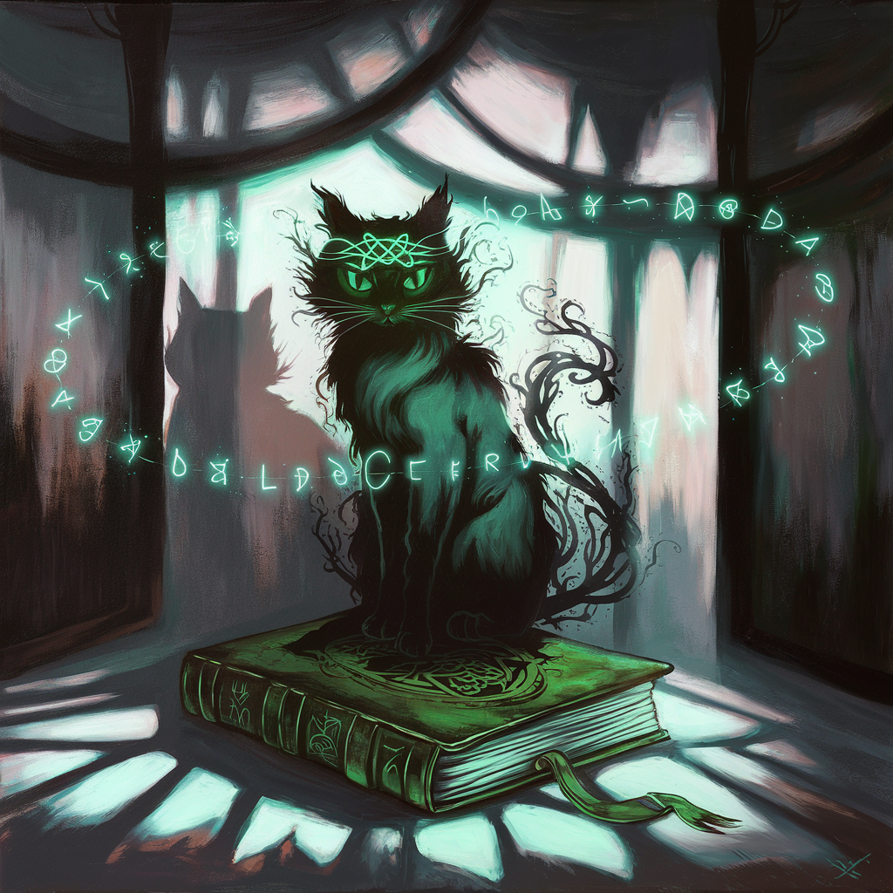

#### Step 3: Critic Refinement and Smoothing

*Final Prompt:* An ethereal shadow painting using luminescent inks on layered translucent silk panels, portraying a shadowy black cat with piercing emerald eyes that subtly dissolve into tendrils of dark mist, emanating an aura of mystery and supernatural presence in a dimly lit arcane chamber. Perched atop an ancient, moss-covered grimoire that emits a faint, otherworldly glow, the cat is surrounded by ethereal floating runes whose soft luminescence casts shifting patterns upon the layered silk, intensifying the mystical atmosphere. The interplay of light passing through the luminescent inks creates depth and movement, bringing the glowing runes and misty elements to life with mesmerizing fluidity.


## Comparison of Language Model Outputs

Lofn supports multiple language models, each with unique characteristics and styles. Below, we compare outputs using the "witch's familiar" example across different language models and image generators.

### Test Input

- **User's Idea**: "I want to capture the essence of a mysterious and powerful witch's familiar."

### Language Models Tested

- **GPT-4**
- **Claude 3.5 Sonnet**
- **Gemini 1.5 Pro**
- **o1-mini**

### Image Generators Tested

- **DALL·E 3**
- **Midjourney**
- **Ideogram**
- **Flux**
- **Playground 2.5**
- **Auroa**
- **StableDiffusion3**

### Observations

- **Language Model Differences**: Each language model brings its own nuances to the generated prompts. GPT-4 may provide more detailed and context-aware prompts, while others may excel in creativity or stylistic diversity.
- **Image Generator Variations**: Different image generators interpret prompts uniquely. Comparing outputs helps identify which combination best suits specific artistic goals.
- **Impact of Style Axes and Creativity Spectrum**: Adjusting these settings can lead to significant variations in the outputs, even with the same language model and image generator.

## Lofn's Prompt Structure and Process Steps

Lofn employs a multi-stage process to generate artwork based on user input. Each stage involves specific prompts and outputs that build upon each other to create a refined and compelling piece of art. Below is a detailed breakdown of each step in the process, including the inputs provided, the tasks performed, and the expected outputs.

### Overview of the Process

1. **Essence and Facets Determination**
2. **Concept Generation**
3. **Artist and Concept Refinement**
4. **Medium Selection**
5. **Refined Medium and Concept Review**
6. **Facets for Prompt Generation**
7. **Artistic Guides Creation**
8. **Image Prompt Generation**
9. **Artist-Refined Prompt**
10. **Prompt Revision and Synthesis**
11. **Title and Caption Generation (Optional)**
12. **Image Generation**

Each of these steps involves specific prompts that guide the AI in generating the desired outputs.Each of these steps involves specific prompts that guide the AI in generating the desired outputs.

---

#### 1. Essence and Facets Determination

**Input:**

- **User's Idea**: A text description of what the user wants to capture in the artwork.

**Process:**

- The AI analyzes the user's idea to extract the core essence and facets.
- Determines the **Creativity Spectrum** percentages (Literal, Inventive, Transformative) based on the idea's complexity and openness to interpretation.
- Assigns values (0-100) to the **Style Axes**.

**Expected Output:**

- A JSON object containing:
  - **Essence**: A concise, emotionally resonant sentence capturing the main idea.
  - **Facets**: Five aspects to judge the alignment of future concepts and prompts with the user's idea.
  - **Creativity Spectrum**: Percentages for Literal, Inventive, and Transformative interpretations.
  - **Style Axes**: Values for each of the ten style axes.

**Example:**

```json
{
  "essence_and_facets": {
    "essence": "The mysterious bond between a witch and her powerful familiar.",
    "facets": [
      "Mystery and intrigue",
      "Magical elements",
      "Emotional connection",
      "Power and strength",
      "Enigmatic atmosphere"
    ],
    "creativity_spectrum": {
      "literal": 50,
      "inventive": 30,
      "transformative": 20
    },
    "style_axes": {
      "Abstraction vs. Realism": 40,
      "Emotional Valence": 70,
      "Color Intensity": 60,
      "Symbolic Density": 50,
      "Compositional Complexity": 65,
      "Textural Richness": 75,
      "Symmetry vs. Asymmetry": 30,
      "Novelty": 80,
      "Figure-Ground Relationship": 55,
      "Dynamic vs. Static": 60
    }
  }
}
```

---

#### 2. Concept Generation

**Input:**

- **Essence and Facets** from Step 1.
- **User's Idea**.

**Process:**

- Generates 12 unique concepts that align with the essence, facets, and creativity spectrum.
- Utilizes creative thinking techniques and considers cultural and historical contexts.
- Ensures concepts are distributed according to the creativity spectrum percentages.

**Expected Output:**

- A JSON array of concepts:

```json
{
  "concepts": [
    {"concept": "A black cat with piercing green eyes sitting on a spellbook."},
    {"concept": "An owl with feathers made of stardust hovering over a cauldron."},
    // ...10 more concepts
  ]
}
```

---

#### 3. Artist and Concept Refinement

**Input:**

- **Concepts** from Step 2.
- **Essence, Facets, Style Axes**, and **Creativity Spectrum**.

**Process:**

- Selects obscure artists whose styles align with each concept.
- For each concept, the AI:
  - Identifies specific aspects of the artist's style that complement the concept.
  - Writes a critique using the artist's perspective.
  - Refines the concept based on the critique, ensuring alignment with style axes.

**Expected Output:**

- A JSON object containing:
  - **Artists**: List of selected artists.
  - **Refined Concepts**: The refined version of each concept.

```json
{
  "artists": [
    {"artist": "Obscure Artist 1"},
    {"artist": "Obscure Artist 2"},
    // ...more artists
  ],
  "refined_concepts": [
    {"refined_concept": "A shadowy fox with luminous eyes weaving through misty woods, symbolizing stealth and wisdom."},
    // ...more refined concepts
  ]
}
```

---

#### 4. Medium Selection

**Input:**

- **Refined Concepts** from Step 3.
- **Essence, Facets, Style Axes**, and **Creativity Spectrum**.

**Process:**

- Selects relevant and innovative art mediums for each refined concept.
- Considers both highly relevant and unconventional aesthetics.
- Ensures the mediums enhance the emotional and thematic elements of the concepts.

**Expected Output:**

- A JSON array of mediums:

```json
{
  "mediums": [
    {"medium": "Chiaroscuro oil painting with rich textures and deep contrasts"},
    // ...more mediums
  ]
}
```

---

#### 5. Refined Medium and Concept Review

**Input:**

- **Refined Concepts** and **Mediums** from previous steps.
- **Artists**.

**Process:**

- Critiques the initial medium choices for alignment with the concepts.
- Brainstorms enhanced medium ideas.
- Refines mediums to optimize visual impact, uniqueness, and alignment with style axes.

**Expected Output:**

- A JSON object containing:
  - **Refined Concepts**: Potentially further refined concepts.
  - **Refined Mediums**: The refined mediums for each concept.

```json
{
  "refined_concepts": [
    {"refined_concept": "A spectral wolf emerging from swirling mist, runes glowing along its ethereal form."},
    // ...more refined concepts
  ],
  "refined_mediums": [
    {"refined_medium": "Ethereal digital illustration with luminescent highlights and soft gradients"},
    // ...more refined mediums
  ]
}
```

---

#### 6. Facets for Prompt Generation

**Input:**

- **Refined Concept** and **Medium** for the selected concept.

**Process:**

- Identifies five facets to ensure image prompts align with the concept and medium.
- Incorporates sensory details and emotional resonance.

**Expected Output:**

- A JSON array of facets:

```json
{
  "facets": [
    "The mystical atmosphere of the scene",
    "The interplay of light and shadow",
    "The ethereal qualities of the familiar",
    "The connection between the witch and the familiar",
    "The depiction of ancient wisdom"
  ]
}
```

---

#### 7. Artistic Guides Creation

**Input:**

- **Refined Concept**, **Medium**, and **Facets**.

**Process:**

- Creates six detailed **Artistic Guides**.
- Each guide includes aspects like mood, artistic flair, style, perspective, lighting, color palette, tools, and storytelling elements.
- Uses vivid, sensory-rich language.

**Expected Output:**

- A JSON array of artistic guides:

```json
{
  "artistic_guides": [
    {"artistic_guide": "A close-up of the familiar's eyes reflecting swirling galaxies, emphasizing its ancient wisdom."},
    // ...more guides
  ]
}
```

---

#### 8. Image Prompt Generation

**Input:**

- **Artistic Guides** from Step 7.
- **Style Axes**, **Facets**, **Refined Concept**, **Medium**, and **User's Idea**.

**Process:**

- Crafts concise yet detailed image generator prompts for each artistic guide.
- Ensures prompts are suitable for AI image generation.
- Aligns with style axes and avoids disallowed content.

**Expected Output:**

- A JSON array of image generation prompts:

```json
{
  "image_gen_prompts": [
    {"image_gen_prompt": "An ethereal digital illustration of a spectral wolf with glowing runes, emerging from misty woods illuminated by moonlight."},
    // ...more prompts
  ]
}
```

---

#### 9. Artist-Refined Prompt

**Input:**

- **Image Generation Prompts** from Step 8.
- **Style Axes**, **Facets**, **Refined Concept**, **Medium**, and **User's Idea**.

**Process:**

- Selects obscure artists to further refine the prompts.
- Rewrites prompts in the artists' styles, incorporating signature techniques and emotional focus.
- Enhances details while maintaining core concepts.

**Expected Output:**

- A JSON array of artist-refined prompts:

```json
{
  "artist_refined_prompts": [
    {"artist_refined_prompt": "A surreal Tenebrist painting depicting a spectral wolf with luminescent runes, its form dissolving into mist under a crescent moon."},
    // ...more prompts
  ]
}
```

---

#### 10. Prompt Revision and Synthesis

**Input:**

- **Artist-Refined Prompts** from Step 9.
- **Style Axes**, **Facets**, **Refined Concept**, **Medium**, and **User's Idea**.

**Process:**

- Critiques prompts using chosen critics' perspectives.
- Ranks prompts and selects top candidates.
- Revises top prompts to address criticisms.
- Synthesizes bottom prompts into new, innovative prompts.

**Expected Output:**

- A JSON object containing:
  - **Revised Prompts**: Improved versions of top prompts.
  - **Synthesized Prompts**: New prompts synthesized from lower-ranked ones.

```json
{
  "revised_prompts": [
    {"revised_prompt": "An eerie digital painting of a spectral wolf with glowing runes, emerging from swirling mist in an ancient forest."},
    // ...more revised prompts
  ],
  "synthesized_prompts": [
    {"synthesized_prompt": "A mist-shrouded landscape where a luminous wolf strides through shadows, runes pulsating along its form."},
    // ...more synthesized prompts
  ]
}
```

---

#### 11. Title and Caption Generation (Optional)

**Input:**

- **Final Prompts** and **Generated Images**.

**Process:**

- Generates titles, Instagram captions, hashtags, and SEO keywords.
- Consults a panel of experts for suggestions.
- Aims to create engaging content for social media sharing.

**Expected Output:**

- A JSON object containing:
  - **Title**
  - **Instagram Post**: Caption and hashtags.
  - **SEO Keywords**

```json
{
  "title": "Guardian of Shadows",
  "instagram_post": {
    "caption": "Unveiling the ethereal 'Guardian of Shadows,' where mysticism meets artistry. What secrets does this spectral wolf hold? 🌙🐺 #Art #DigitalIllustration #Mystical",
    "hashtags": ["#Art", "#DigitalIllustration", "#Mystical", "#Ethereal", "#SpectralWolf"]
  },
  "seo_keywords": ["art", "digital illustration", "mystical art", "spectral wolf", "ethereal imagery"]
}
```

---

#### 12. Image Generation

**Input:**

- **Final Prompts** from Step 10.
- **Configured Image Generation Settings**.

**Process:**

- Generates images using the selected image model (e.g., DALL·E 3).
- Applies any additional image generation parameters specified.

**Expected Output:**

- Generated images saved to the specified directory.
- Displayed within the Lofn UI.


## Contributing

We welcome contributions to Lofn! To contribute:

1. **Fork the repository**.

2. **Create a new branch** for your feature or bug fix.

3. **Make your changes** and commit them with descriptive commit messages.

4. **Push your changes** to your forked repository.

5. **Submit a pull request** to the main Lofn repository.

Please ensure that your contributions adhere to our [code of conduct](CODE_OF_CONDUCT.md) and [contribution guidelines](CONTRIBUTING.md).

## License

Lofn is released under the [Apache 2.0 License](LICENSE).