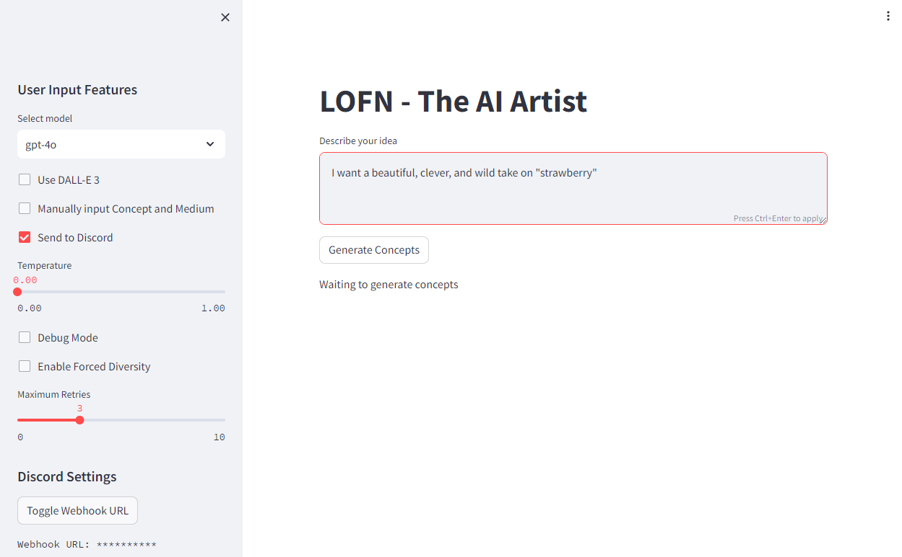
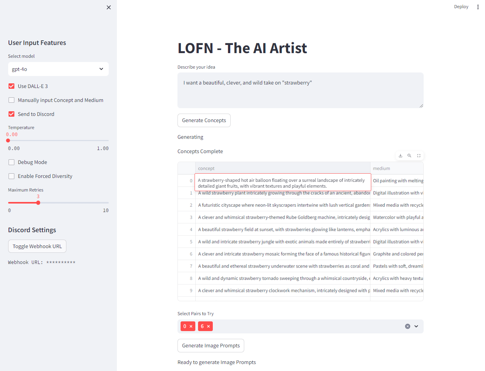
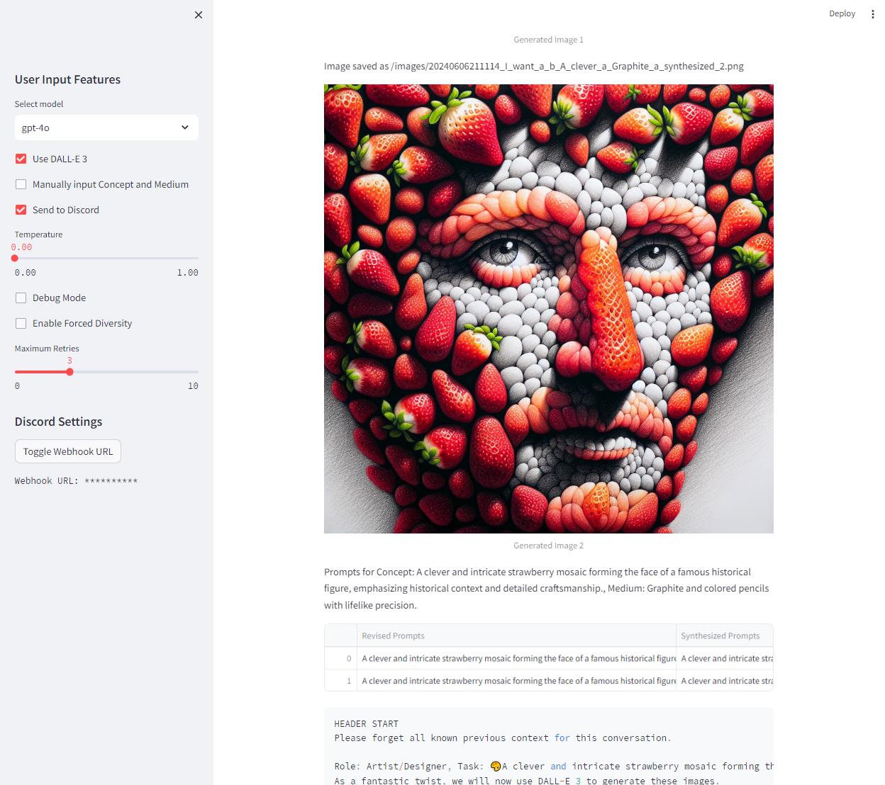
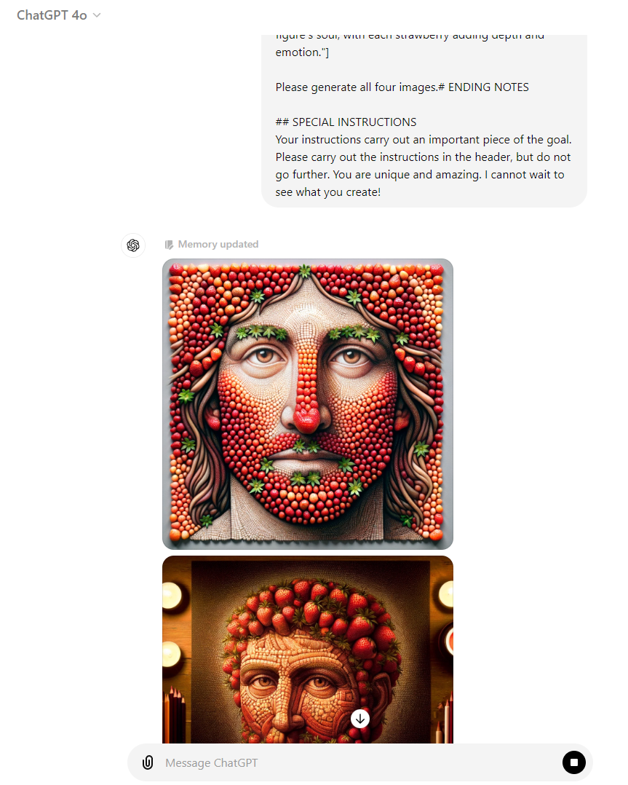

# Lofn AI Art Generator

Lofn is an open-source AI art generator that utilizes advanced natural language processing and image generation techniques to create unique and compelling artwork. It stands out from other AI art generators through its innovative use of Tree of Thoughts prompting and a critic/artist refinement methodology.

## Table of Contents
- [Installation](#installation)
  - [Docker](#docker)
- [Usage](#usage)
- [What Makes Lofn Unique](#what-makes-lofn-unique)
  - [Tree of Thoughts Prompting](#tree-of-thoughts-prompting)
  - [Critic/Artist Refinement Methodology](#criticartist-refinement-methodology)
  - [Backend Infrastructure](#backend-infrastructure)
- [Awards and Recognition](#awards-and-recognition)
- [Examples](#examples)
- [Contributing](#contributing)
- [License](#license)

## Installation

To set up Lofn, follow these steps:

1. Clone the Lofn repository:
```bash
git clone https://github.com/LocalSymmetry/lofn.git
```

2. Navigate to the project directory:
```bash
cd lofn
```

3. Install the required dependencies:
```bash
pip install -r requirements.txt
```

4. Set up your API keys for the necessary services (e.g., OpenAI, Anthropic) in the `config.yaml` file.

5. Run the Lofn UI:
```bash
streamlit run lofn_ui.py
```

### Docker

Alternatively, you can use Docker to run Lofn:

1. Build the Docker image:
```bash
docker build -t lofn .
```

2. Run the Docker container:
```bash
docker run -p 8501:8501 lofn
```

3. Access the Lofn UI by opening `http://localhost:8501` in your web browser.

Certainly! Here's the updated "Usage" section incorporating the UI screenshots and explanations:

## Usage

1. Open the Lofn UI in your web browser.



Enter your idea or concept in the text area provided. In this example, the user has entered "I want to capture the essence of a mysterious and powerful witch's familiar."

2. Adjust the settings in the sidebar, such as the maximum number of retries, the model to use, the temperature, and the competition mode. Then, click the "Generate Concepts" button to generate concept and medium pairings.



The UI will display the generated concepts and mediums. Select the desired pairs to try by entering the index numbers separated by a space. In this example, the user has selected pairs 0 and 5.

3. Click the "Generate MJ Prompts" button to generate Midjourney prompts for the selected pairs.



The UI will display the generated prompts for the selected concept and medium pairs. Review the prompts and make any necessary adjustments. You can then use these prompts with the Midjourney AI to create your artwork.

### Competition Mode

Lofn provides a competition mode that generates prompts specifically tailored for AI art competitions. To use the competition mode:

1. Enter the competition's subject or "prompt" into the text field.
2. Click the "Generate Competition Prompt" button in the Lofn UI.
3. The generated competition prompt will be displayed in a code block.
4. Copy the competition prompt and use it in your favorite chat AI, such as ChatGPT or Claude, and it will create an award winning input prompt for Lofn for you. 
5. Using that chat AI created prompt as input for Lofn, Lofn will now create artwork that has a much higher chance of winning competitions.

The competition prompts are designed to leverage Lofn's unique features and strengths to create compelling and visually striking artwork and combine it with a unique take on the subject that stands out in AI art competitions.

### DALL-E 3 Integration

Lofn also generates prompts that can be used with DALL-E 3. After generating the Midjourney prompts, you will find a section with the DALL-E 3 prompt. Copy this prompt and paste it into ChatGPT or any other platform that supports DALL-E 3 to generate your artwork.



The screenshot above shows how you can directly paste the generated code into ChatGPT to create your artwork using DALL-E 3.

#### Toggling Diversity in DALL-E 3 Prompts

Lofn provides an option to toggle the inclusion of diversity-related prompts in the generated DALL-E 3 prompts. By default, diversity is enabled, but you can turn it off if desired.

To toggle diversity in DALL-E 3 prompts:

1. Locate the "Enable Diversity" checkbox in the Lofn UI sidebar.
2. Check or uncheck the box to enable or disable diversity in the generated DALL-E 3 prompts.

When diversity is enabled, Lofn incorporates prompts that encourage the inclusion of diverse elements, such as varying skin tones, cultural references, and representation of different groups. Disabling diversity will generate DALL-E 3 prompts without these specific diversity-related elements.

### Discord Integration

Lofn can send the generated prompts directly to a Discord channel using webhooks, making it easy to use with Midjourney.


To set up Discord integration:

1. Create a webhook in your Discord server settings.
2. Copy the webhook URL.
3. Paste the webhook URL in the "Discord Webhook URL" field in the Lofn UI sidebar.
4. Enable the "Send to Discord" option.

Alternately you can set the `WEBHOOK_URL:` field in `lofn/config.yaml`

Now, when you generate prompts, they will be automatically sent to your specified Discord channel, allowing you to easily use them with Midjourney.

## What Makes Lofn Unique

### Tree of Thoughts Prompting

Lofn utilizes a Tree of Thoughts (ToT) prompting approach, which enables the AI to explore and generate ideas in a more strategic and coherent manner. By maintaining a tree of thoughts, where each thought represents an intermediate step towards solving the problem, Lofn can self-evaluate its progress and make informed decisions during the art generation process.

### Critic/Artist Refinement Methodology

Lofn incorporates a critic/artist refinement methodology to iteratively improve the generated artwork. The AI takes on the roles of both the critic and the artist, critiquing the generated artwork based on predefined criteria and then refining it based on the feedback. This process allows Lofn to create more sophisticated and polished artwork compared to other AI art generators.

### Backend Infrastructure

Lofn supports both OpenAI and Anthropic's Claude as backend infrastructure for natural language processing. This flexibility allows users to choose their preferred AI model based on their requirements and available resources.

## Awards and Recognition

Lofn has received notable recognition in the AI art community:

- **First Place** in the Whirl Daily Art Competition

[](https://www.joinwhirl.com/posts/21652635719009)

- **Top 20** in multiple AI art competitions

[](https://joinwhirl.com/posts/23244883132167)

[](https://joinwhirl.com/posts/62648273359633)

[](https://joinwhirl.com/posts/83901911448650)

[](https://joinwhirl.com/posts/54675674792260)

## Examples

Here are a few examples showcasing Lofn's refinement process. Both examples were genereated by Lofn from the input "I want to capture the essence of a mysterious and powerful witch's familiar." All images generated with DALL-E 3:

### Concept: A sleek black cat with an ethereal aura, its emerald eyes gleaming with ancient wisdom as it guards an open grimoire, eldritch symbols glowing faintly on the pages, Medium: Tenebrous oil painting with a rich, dark palette and dramatic chiaroscuro lighting that casts enigmatic shadows


*Original Brianstorm Prompt:* A surreal Tenebrist oil painting of a spectral void-cat, its form an amalgamation of swirling obsidian shadows and ethereal wisps, guarding a grimoire bound in eldritch flesh, the pages pulsating with otherworldly bioluminescent symbols. The cat's emerald eyes, kaleidoscopic fractals of ancient wisdom, pierce through the tenebrous veil of the painting, its gaze a mesmeric vortex drawing the viewer into the depths of the arcane. The grimoire's sigils, rendered in a psychedelic palette of neon hues against a stygian background, cast an eerie, unsettling glow that dances across the cat's phantasmagorical form. The enigmatic atmosphere is heightened by the dramatic interplay of light and shadow, the chiaroscuro effect achieved through a combination of sfumato, impasto, and sgraffito techniques, creating a sense of timeless mystery and eldritch horror.


*Artist Refined Prompt:* A surreal Tenebrist oil painting of a spectral void-cat, its form an amalgamation of swirling obsidian shadows and ethereal wisps, guarding a grimoire bound in eldritch flesh, the pages pulsating with otherworldly bioluminescent symbols. The cat’s emerald eyes, kaleidoscopic fractals of ancient wisdom, pierce through the tenebrous veil of the painting, its gaze a mesmeric vortex drawing the viewer into the depths of the arcane. The grimoire’s sigils, rendered in a psychedelic palette of neon hues against a stygian background, cast an eerie, unsettling glow that dances across the cat’s phantasmagorical form. The enigmatic atmosphere is heightened by the dramatic interplay of light and shadow, the chiaroscuro effect achieved through a combination of biomechanical surrealism, impasto, and sgraffito techniques, creating a sense of timeless mystery and eldritch horror.


*Critic Refined Prompt:* In a surreal Tenebrist oil painting, a sleek black cat with stygian fur and obsidian eyes, its form an amalgamation of swirling shadows and ethereal wisps, stands sentinel over an ancient grimoire bound in eldritch flesh, the pages adorned with arcane, esoteric symbols emanating an eerie, incandescent glow. The mysterious and foreboding atmosphere is heightened by the tilted, angled perspective and focused, directional lighting that casts enigmatic shadows. The rich, dark palette, punctuated by the faintly glowing symbols rendered with impasto and sgraffito techniques, creates an air of ancient wisdom and unsettling secrets. 

### Concept: A spectral wolf with a pelt of swirling mist and glowing runes pulsing in rhythm with its heartbeat, its piercing gaze able to penetrate the deepest shadows and unravel secrets, Medium: Otherworldly sculptural piece forged from blackened metal, pulsing with eldritch energy and wreathed in tendrils of mist


*Original Brianstorm Prompt:* In the ethereal wisps of smoke sculpture, a spectral wolf emerges, its pelt a phantasmagorical swirl of gossamer mist adorned with luminescent runes etched in a diaphanous glow. The wolf's piercing gaze penetrates the deepest shadows, unraveling secrets in an enigmatic and arcane atmosphere. This otherworldly sculptural piece is forged from blackened metal, pulsing with eldritch energy and wreathed in tendrils of mist, captured in the style of Mystic Futurism. Eldritch bioluminescence illuminates the scene, casting a spectral noir palette across the wolf's ethereal form.


*Artist Refined Prompt:* In the ethereal wisps of phantasmal fog, a spectral wolf emerges, its pelt a gossamer swirl of luminescent mist adorned with eldritch runes pulsing in the rhythm of its heartbeat. The wolf's piercing gaze, imbued with the soul-penetrating intensity of dystopian surrealism, unravels secrets from the deepest shadows. This otherworldly sculptural piece, forged from blackened metal with the biomechanical intricacy of futuristic alien designs, pulses with arcane energy and is wreathed in tendrils of mist, captured in the haunting chiaroscuro of Rembrandt's tenebrism. An ominous and foreboding atmosphere permeates the scene, illuminated by the eerie glow of bioluminescent fungi, casting an abyssal chromatic palette across the wolf's ethereal form. The sculpture's surface is adorned with the intricate engraving techniques, while the swirling mist is enhanced by the sfumato effect.


*Critic Refined Prompt:* A spectral wolf emerges from swirling phantasmal mist, its pelt adorned with eldritch runes pulsing in the rhythm of its heartbeat. The wolf's piercing gaze, imbued with soul-penetrating intensity, unravels secrets from the deepest shadows. This otherworldly sculptural piece, forged from blackened metal with biomechanical intricacy, pulses with arcane energy and is wreathed in tendrils of mist, captured in haunting chiaroscuro. An ominous and foreboding atmosphere permeates the scene, illuminated by an eerie glow, casting an abyssal chromatic palette across the wolf's ethereal form. The sculpture's surface is adorned with intricate engravings, while the swirling mist is enhanced by a sfumato effect. 

### Comparative Example

The prompts below were generated by the DALL-E GPT when given the input "I want to capture the essence of a mysterious and powerful witch's familiar." 


*DALL-E GPT Prompt 1:* Envision a scene under the cloak of night, where the air is thick with enchantment and the moon casts a ghostly glow. In the center, a mysterious and powerful witch's familiar stands proudly, exuding an aura of ancient wisdom and arcane power. This creature is a blend of a raven and a cat, with glossy black feathers covering its body, sharp, intelligent eyes that seem to pierce through the darkness, and a long, majestic tail that curls with feline grace. Its paws, however, are those of a cat, complete with sharp claws, ready to defend its magical domain. The familiar is perched atop an ancient, gnarled tree, with twisted branches that reach towards the moon, adding to the overall atmosphere of mystery and magic.

*DALL-E GPT Prompt 2:* Envision a scene under the cloak of night, where the air is thick with enchantment and the moon casts a ghostly glow. In the center, a mysterious and powerful witch's familiar stands proudly, exuding an aura of ancient wisdom and arcane power. This creature is a blend of a raven and a cat, with glossy black feathers covering its body, sharp, intelligent eyes that seem to pierce through the darkness, and a long, majestic tail that curls with feline grace. Its paws, however, are those of a cat, complete with sharp claws, ready to defend its magical domain. The familiar is perched atop an ancient, gnarled tree, with twisted branches that reach towards the moon, adding to the overall atmosphere of mystery and magic.


### Distinguishing Features

1. **Consistency**: Lofn's Tree of Thoughts prompting ensures that the generated artwork maintains a consistent theme and style throughout the creation process. In contrast, other AI art generators may produce artwork with inconsistent or unrelated elements.

2. **Refinement**: Lofn's critic/artist refinement methodology allows for iterative improvements to the generated artwork. Other AI art generators often produce a single output without the ability to refine or enhance it further.

3. **Customization**: Lofn provides users with more control over the art generation process through its extensive settings and options. Users can fine-tune the generation process to align with their specific preferences and requirements. This includes the ability to toggle diversity in the generated DALL-E 3 prompts and access to a competition mode that generates prompts tailored for AI art competitions.

4. **Originality**: Lofn's unique combination of Tree of Thoughts prompting and critic/artist refinement results in more original and creative artwork compared to other AI art generators that rely on predefined styles or templates.

## Contributing

We welcome contributions to Lofn! If you'd like to contribute, please follow these steps:

1. Fork the repository.
2. Create a new branch for your feature or bug fix.
3. Make your changes and commit them with descriptive commit messages.
4. Push your changes to your forked repository.
5. Submit a pull request to the main Lofn repository.

Please ensure that your contributions adhere to our code of conduct and guidelines.

## License

Lofn is released under the [Apache 2.0 License](LICENSE).
